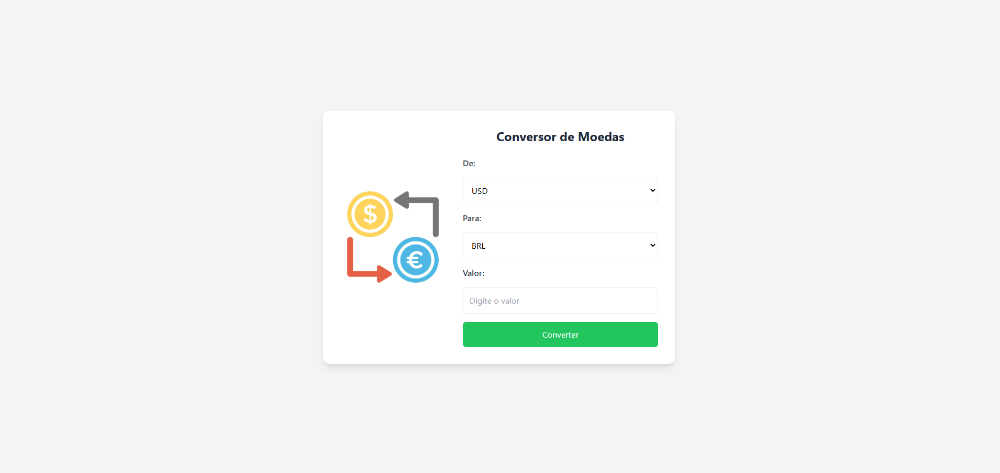

---

```markdown
# Conversor de Moedas em React

Este é um projeto simples de **Conversor de Moedas** construído com **React**. Ele permite a conversão de diferentes moedas em tempo real, utilizando a API **AwesomeAPI** para buscar as taxas de câmbio atualizadas.



## Tecnologias Utilizadas

- **React**: Biblioteca para construir interfaces de usuário.
- **Tailwind CSS**: Framework de estilização utilitário para criar a interface do usuário.
- **API AwesomeAPI**: Para buscar as taxas de câmbio entre diferentes moedas.

## Funcionalidades

- **Conversão de moedas**: O usuário pode converter valores entre diferentes moedas como **USD**, **EUR**, **BRL**, **GBP**, entre outras.
- **Escolher moedas**: O usuário pode selecionar as moedas de origem e destino da conversão.
- **Exibição do valor convertido**: O valor convertido é mostrado em tempo real assim que o usuário insere o valor e seleciona as moedas.

## Como Usar

### Requisitos

- **Node.js** e **npm** (ou **yarn**) instalados em seu computador.

### Passos para rodar o projeto localmente

1. Clone este repositório para o seu computador:

   ```bash
   git clone https://github.com/seu-usuario/nome-do-repositorio.git
   cd nome-do-repositorio
   ```

2. Instale as dependências do projeto:

   ```bash
   npm install
   ```

   ou

   ```bash
   yarn
   ```

3. Inicie o servidor de desenvolvimento:

   ```bash
   npm start
   ```

   ou

   ```bash
   yarn start
   ```

4. Abra o navegador e acesse o seguinte endereço:

   ```
   http://localhost:3000
   ```

### Como usar o conversor

1. Selecione a moeda de origem e a moeda de destino.
2. Digite o valor que deseja converter.
3. O valor convertido será exibido abaixo do campo de entrada em tempo real.

## Estrutura do Projeto

```
/public
  - index.html (arquivo HTML principal)
/src
  - App.tsx (componente principal que contém a lógica de conversão)
  - App.css (estilos principais)
  - assets/5082433-conceitos-de-conversao-de-moeda-vetor.jpg (imagem para ilustrar a página)
/package.json (arquivo de dependências)
```
---

## Contribuições

Se você deseja contribuir para este projeto, fique à vontade para fazer um **fork** do repositório e enviar um **pull request** com suas melhorias.

## Licença

Este projeto está licenciado sob a [MIT License](LICENSE).

```

